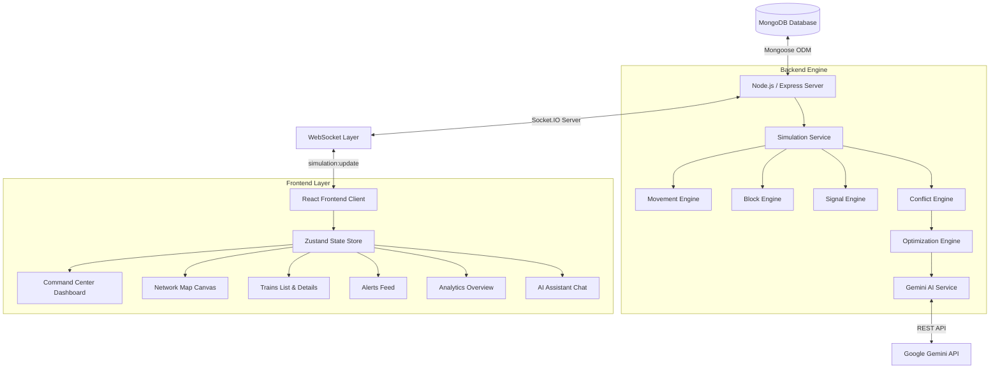

# System Architecture — RailOptix-AI

---

## 1. High-Level System Architecture

RailOptix-AI follows a decoupled **MERN + Real-Time WebSockets + AI Proxy Architecture**:

---

## 2. Component Decoupling & Authority

### 1. Database Layer (MongoDB)
- Holds authoritative collection records: `Train`, `Station`, `Track`, `TrackBlock`, `Signal`, `Conflict`, `Event`.
- Auto-seeded on server boot if collections are empty.

### 2. Simulation & State Engine (Node.js)
- Owns the single source of truth for train positions (`position: 0.0 - 1.0`), current tracks, speed, and delay.
- Runs a deterministic loop every `SIMULATION_TICK_MS` (1000ms).

### 3. Real-Time WebSockets (Socket.IO)
- Emits structured state payloads (`simulation:update`) containing trains, tracks, stations, signals, conflicts, events, metrics, and recommendations.

### 4. Frontend Layer (React + Zustand)
- Receives Socket.IO payload and updates local Zustand store.
- **Never invents train coordinates or authoritative state independently.**
- Provides fallbacks if WebSocket connection drops temporarily.

### 5. AI Proxy Layer (Gemini)
- Receives structured operational context from Express backend.
- Exposes REST endpoints (`/api/ai/recommendations` and `/api/ai/chat`) to prevent API key exposure to client browsers.
