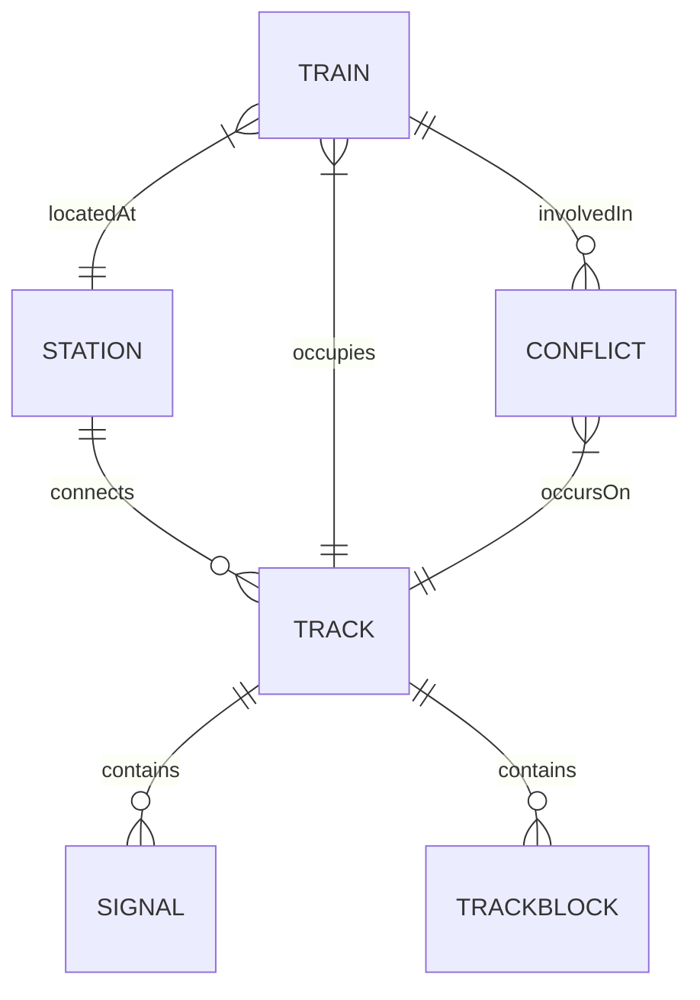

# Data Relationship Model — RailOptix-AI

---

## 1. Entity Relationship Overview

---

## 2. Model Integrity Rules

1. **Train - Track Association**: Every train references a `currentTrackId`. The `position` scalar (0.0 to 1.0) maps directly to the train's geographic position along the track vector.
2. **Conflict Uniqueness**: Conflicts are indexed by `conflictId` (e.g., `CONF-NDLS-12951-12424`). Once resolved via `PATCH /api/conflicts/:id/resolve`, the `resolved` flag becomes `true` and the conflict is removed from active simulation broadcasts.
3. **Audit Trail**: Operational events recorded in the `Event` collection store structured JSON metadata detailing train actions, signal aspect shifts, and conflict resolutions.
